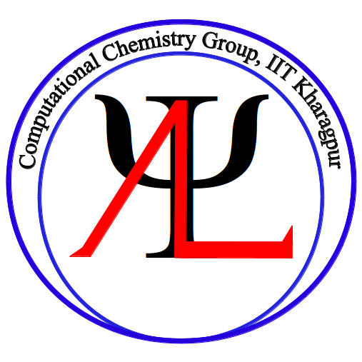

==================================
Welcome to AnoopLab's Wiki !!
==================================

Hello there !! 

   
We are a theoretical and computational chemistry research group at the 
Indian Institute of Technology Kharagpur, India.

**Want to know more about our research ?** `Click here <http://www.chemistry.iitkgp.ac.in/~anoop/>`_

This preliminary guide is created for the following reasons

- Help  beginners to quick start computational chemistry
- Set up different softwares in the `IIT KGP <http://www.iitkgp.ac.in/>`_ supercomputing facility.  
- Some essential tutorials about linux and programming 

**Want to help?**

Please feel free to contribute. Send PR to our github repo.

Quantum Chemistry Packages
==========================

Currently we can offer help for these softwares  

- Gaussian
- ORCA 
- Turbomole
- xtb 
- `PyAR <https://github.com/anooplab/pyar>`_
- Psi4
- CFour 
- Mopac

External Libraries/Packages
===========================

- Conda Python
- OpenMPI
- OpenBLAS
- Scalapack
- Lapack

  
.. toctree::
   :maxdepth: 3
   :caption: SLURM 

   basic_slurm

.. toctree::
   :maxdepth: 3
   :caption: Installation Guides

   orca/ORCAsetup
   xtb/xtbsetup

.. toctree::
   :maxdepth: 3
   :caption: External Libs

   python/condasetup

.. toctree::
   :maxdepth: 3
   :caption: Misc
   
   how_to_contribute
   license
   credits
   

..
  * :ref:`genindex`
  * :ref:`modindex`
  * :ref:`search`
